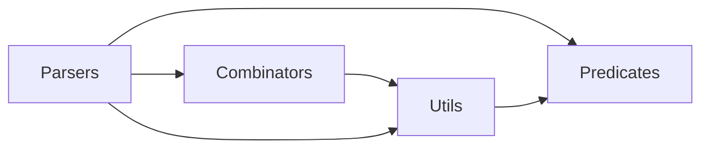

# Parser Combinators, applied to JSON parsing

This project is an excerise in using the Functional Programming concept of Combinators to create parsers and combine them into a mechanism for processing a JSON string.

## Modules and dependencies



### Pasers

#### Public

- `jsonParser` is the primary parser that takes in a JSON string and returns either a `State` object when valid or `false` when invalid.
  - Error: Unexpected lack of input
  - Error: Unexpected end of input

#### Private

All of the following functions expect a `State` object as input, and provide an updated `State` object or `false` as output. They are composed of `predicate` function conbine with `combinator` functions.

- `valueParser`: After removing and premilinary whitespace (specifically space characters), this parser updates the `State` object if any of the following parsers match a token: `baseParser`, `stringParser`, `numberParser`, `arrayParser` or `objectParser`.
- `baseParser`: Matches Boolean values or the Base value `null`.
- `stringParser`: Matches any number of printable, escaped or unitcode characters delimited by the `"` character.
  - Error: Missing string terminator
- `arrayParser`: Matches any number of values delimited by the `[` and `]` characters and separated by the `,` character. Spaces between the delimiters will be retained.
  - Error: Missing array value
  - Error: Missing array terminator
- `objectParser`: Matches any number of `key-value pairs` delimited by the `{` and `}` characters and separated by the `,` character.
  - Error: Missing object key-value pair
  - Error: Missing object terminator
- `keyValuePair`: A pair of tokend separated by a `:` character. The key is expected to be a string.
  - Error: Missing key-value separator
  - Error: Missing property value
- `numberParser`: A composition of an `integer` followed by optional `fraction` and/or `exponent` tokens.
- `integerParser`: Matches an optional minus sign followed by either a zero or an non-zero followed by an option number of digits.
- `fractionParser`: Matches a decimal point (period) followed by one or more digits.
  - Error: Missing fractional digit
- `exponentParser`: Matches a exponent symbol (e or E) followed by one or more digits.
  - Error: Missing exponent digit

### Combinators

#### Public

- `or` processes a list of parsers returning an updated `State` object if any of them match a token.
- `and` processes a list of parsers returning an updated `State` object only if all of them match a token.
- `optional` specialisation of the `repeat` function using default options - min:0 and max:Infinity.
- `oneZero` specialisation of the `repeat` function using max:1 to expect no more than one occurance of a token.
- `onePlus` specialisation of the `repeat` function using min:1 to expect at least one occurance of a token.
- `consolidate`: Specialisation of the `combine` function that uses the `joinValues` function to combine individual characters into string/number tokens.
- `compress`: Specialisation of the `combine` function that uses the default function to conbine the values or an array or key-value pairs of an object.

#### Private

- `combinator`: facilitates the processing of parsers in sequence and returns the `State` object if all of them match a token (`and`) or any one of them matches a token (`or`).
- `repeat`: facilitates recuring matching of tokens given a specific parser, and configured with options.
- `combine`:
- `joinValues`: function used to combine string and number elements into a single token.

### Predicates

#### Private constants

- **ESCAPED_CHARACTERS** An array containg: `'\\\"'`, `'\\\\'`, `'\\/'`, `'\\b'`, `'\\f'`, `'\\n'`, `'\\r'`, `'\\t'`.
- **FIRST_UNICODE_CHAR**: `0x0080`

#### Public functions

- `matchText` is used to generate the predicates functions but only public for testing purposes.

**Base Values**

- `isBooleanTrue`: returns true if the input token is the Boolean `true` value.
- `isBooleanFalse`: returns true if the input token is the Boolean `false` value.
- `isNullValue`: returns true if the input token is the Base value `null`.

**String**

- `isStringDelim`: returns true only if the input token is a string delimiter character `"`.
- `isEscapePrefix`: (private) returns true only if the input token is an escape prefix character `\`.
- `isControlChar`: (private) returns true only if the input token has an ASCII code less than 32 or equal to 127.
- `isPrintableChar`: returns true only if the input token is not a control character, string delimiter or escape prefix.
- `isEscaped`: returns true only if the input token is in the **ESCAPED_CHARACTERS** set.
- `isUnicode`: returns true only if the input token is a code pointe greater that **FIRST_UNICODE_CHAR**.

**Number**
The **Number** token is a composite of up to three different sections: _Integer_, _Fraction_ and _Exponent_.

**Integer**

- `isMinusSign`: returns true only if the input token is a minus sign `-`.
- `isZero`: returns true only if the input token is the digit `0`.
- `isPositiveDigit`: returns true only if the input token is a digit in the range `1..9`.
- `isSingleDigit`: returns true only if the input token is a digit in the range `0..9`.

**Fraction**

- `isDecimalPoint`: returns true only if the input token is a decimal point (period) character `.`.

**Exponent**

- `isDecimalPoint`: returns true only if the input token is an exponent symbol `e` or `E`.
- `isArithmeticSigns`: returns true only if the input token is an arithmetic sign `+` or `-`.

**Array**

- `isArrayStart`: returns true only if the input token is a start array delimiter `[`.
- `isArrayEnd`: returns true only if the input token is an end array delimiter `]`.
- `isArraySeparator`: returns true only if the input token is an array value separation character `,`.

**Object**

- `isObjectStart`: returns true only if the input token is a start object delimiter `{`.
- `isObjectEnd`: returns true only if the input token is an end object delimiter `}`.
- `isObjectSeparator`: returns true only if the input token is an object property separation character `,`.
- `isObjectKeyValSep`: returns true only if the input token is an object key/value pair separation character `:`.

**Whitespace**

- `isSpace`: returns true only if the input token is a literal space character.
- `isWhitespace`: returnd true if the input token is any of the non-space whitespace chacarters `\n`, `\r` or `\t`.

### Utils (all public)

- `State` - Object factory function takes in a JSON string (text) and generates an object of the following structure;

```JS
{
  text,
  index: 0,
  results: [],
  error: '',
}
```

- `Parser`: is the primary functio of the module. It takes a predicate function and an `options` object with the following properties:

```JS
{
  size: 1,
  errorWhitespace: false,
  ignoreWhitespace: true,
}
```

It returns a function that accepts a `state` object and processes the next token.

- `ParserWithWhitespace`: Specialisation of the `Parser` function with the `ignoreWhitespace` flag set to `false`, so it can be included in strings.
- `ParserWithoutWhitespace`: Specialisation of the `Parser` function with the `errorWhitespace` flag set to `true`, so any spaces encountered with cause an error.

- `inError`: A predicate for the `state` object having an error value.
- `reportError`: Updates the `state` object to include an error message if the specified parser fails, and no previous error message has been recorded.
- `EOI`: A predicate indicating if the text in the `state` object has been exhausted.
- `readText`: returns the next candidate token text. By default this is a single character but can be multiple characters.
- `advance`: pushes the index forward by the length of a toekn and updates the results array with the text of the token.
- `prepareInput`: Takes a JSON string (`text`) cna processes it into a `state` object.
- `consumeWhitespace`: Moves the index forward until the next character is not a space or whitespace or the End Of Input (EOI) is encountered.

## References

1. [Parser Combinators From Scratch, by Low Byte Productions](https://www.youtube.com/playlist?list=PLP29wDx6QmW5yfO1LAgO8kU3aQEj8SIrU)
2. [Understanding parser combinators: a deep dive, by Scott Wlaschin](https://www.youtube.com/watch?v=RDalzi7mhdY)
3. [You could have invented Parser Combinators, by Daniel Holden](https://theorangeduck.com/page/you-could-have-invented-parser-combinators)
